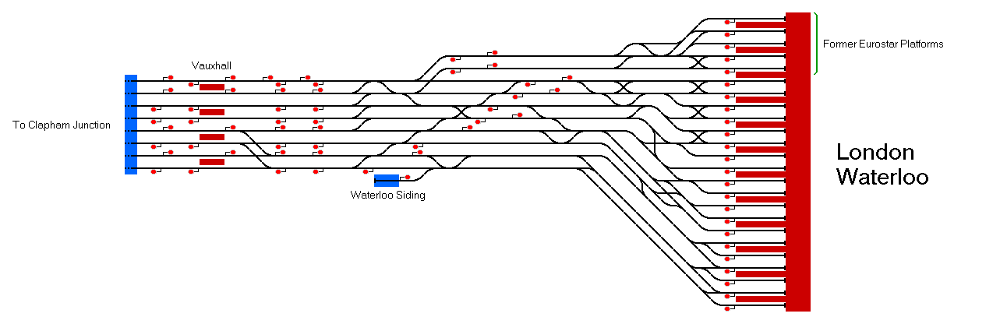

# London Waterloo, UK
This is a simulation of London Waterloo and Vauxhall stations in London, UK.

## Current Status

| Stage         | Status        |
| ------------- |:-------------:|
| Track Plan     |  |
| Signalling      |       |
| Naming |       |
| Speed Limits |  |
| Distances |  |
| Timetable | * |
| Documentation |  |

*The included timetable runs from 0550 to about 0750.

## Data Sources

- [TRAKSY.UK](https://traksy.uk/live)
- [OpenStreetMap](https://www.openstreetmap.org/#map=17/51.50138/-0.11408)
- [4K Cabview Class 444 029 London Waterloo - Southampton Central - 15.06.2017 by Koleją z Mateuszem](https://youtu.be/O7hfyN5EvQM)

Status icons by Freepik, pixelmeetup, Pixel Perfect on FlatIcon.com.
